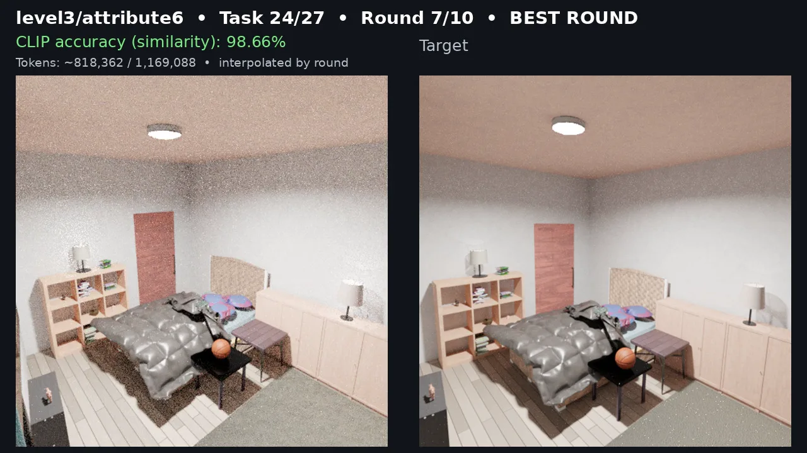

# bpy.dev

Nuxt + Nuxt UI homepage for **bpy.dev**, introducing a Python-first Blender runtime, the narrow [`blender-mcp`](https://github.com/bpy-dev/blender-mcp) interface, and initial BlenderBench evidence.

## Latest BlenderBench run

[](https://huggingface.co/datasets/michaelgold/blenderbench-direct-results/resolve/7c2c43be4517aee4d76d2b445578988de186970c/video/blenderbench-complete-compilation.mp4)

[Watch the complete 27-task, 270-round BlenderBench video](https://huggingface.co/datasets/michaelgold/blenderbench-direct-results/resolve/7c2c43be4517aee4d76d2b445578988de186970c/video/blenderbench-complete-compilation.mp4). The on-video “CLIP accuracy” label means CLIP image-embedding cosine similarity, not literal task accuracy.

## Local development

Requires Node.js 24 and pnpm 10 (the exact pnpm version is recorded in `packageManager`).

```bash
pnpm install
pnpm dev
```

Open <http://localhost:3000/>.

## Quality checks and static generation

```bash
pnpm test
pnpm typecheck
pnpm generate
pnpm test:site
pnpm check:refs
```

`pnpm generate` writes the deployable static site to `.output/public`. To inspect that exact artifact locally:

```bash
python3 -m http.server 8000 --directory .output/public
```

## Deployment

`.github/workflows/pages.yml` installs the frozen pnpm dependency graph, runs structural tests and type checking, generates the site, validates the generated HTML and local references, then uploads `.output/public` to GitHub Pages. The repository Pages source must be set to **GitHub Actions**.

`public/CNAME` is copied into the generated output and configures the custom `bpy.dev` domain. DNS must be configured separately in the domain provider and repository settings.

## Benchmark asset

`public/assets/blenderbench-result.webp` includes a target image from [BlenderBench by DietCoke4671 and contributors](https://huggingface.co/datasets/DietCoke4671/BlenderBench), dataset revision `203e4d325e9438ca55b29bdfc4f6a90842d74e68`, licensed [CC BY 4.0](https://creativecommons.org/licenses/by/4.0/). Keep the visible attribution with any reuse of the benchmark visual.
